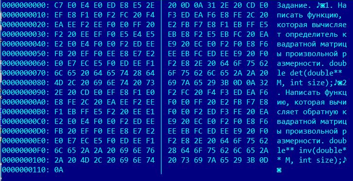

#### Задание 1
Дан текстовый файл, в котором математические формулы представлены в формате TeX и заключены в ```$...$```  или ```$$...$$```.
Заменить блоки на ```<math>...</math>```.

Имена входного и выходного файлов в командной строке.

#### Задание 2
Написать программу, которая записывает информацию из входного файла в следующем виде (см. рис): 
* Сдвиг от начала  файла для строки символов (10 символов с шестнадцатеричным сдвигом).
* Двоеточие, пробел.
* 8 кодов символов строки из входного файла, записанные как 16-ое число и пробел.
* Вертикальная черта.
* Следующие 8 кодов символов строки из входного файла, записанные как 16-ое число и пробел.
* 16 символов из входного файла (символы с кодами меньше 32 (управляющие символы) выводить как пробелы или точки).

В итоге должен получиться текстовый файл, например, как на картинке.

